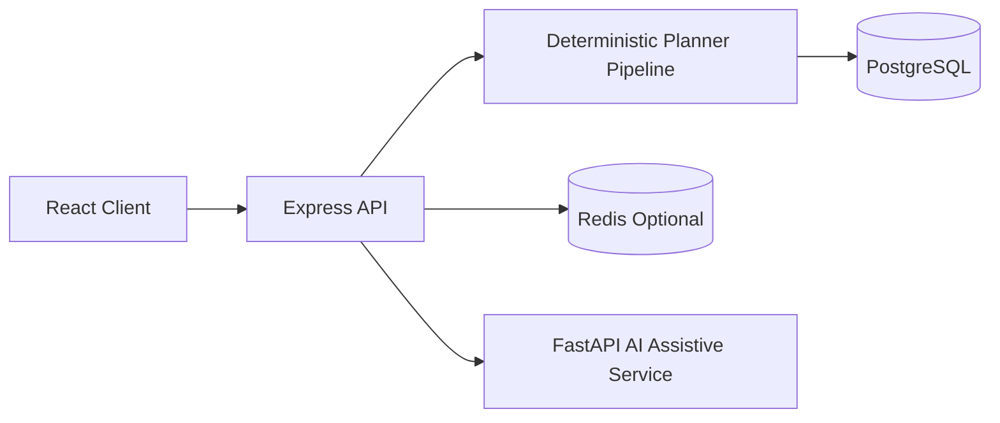

# AAROGYA
### A contract-first deterministic meal planning engine for Ayurveda-informed nutrition.
> "A deterministic planning platform where safety constraints and versioned contracts govern meal decisions."


-8b5cf6)

---

## Overview

AAROGYA solves the reliability gap in nutrition planning where AI-generated suggestions can violate hard constraints such as allergies, diet restrictions, and rule priorities. It is built for users and teams that require auditable, repeatable plan generation rather than opaque recommendations. The core approach is a deterministic multi-stage backend pipeline validated by AJV contracts, with optional AI services confined to assistive tasks.

---

## Architecture

### High-Level Diagram




### Key Design Decisions

**Contract-first boundary for all planning APIs**  
All key request/response payloads (`decision`, `daily`, `weekly`, `trace`, `health`, `metrics`) are schema-validated via AJV in `apps/backend/src/contracts`. This reduces silent drift between frontend and backend. Tradeoff: schema evolution is stricter and slower because changes require explicit contract updates.

**Deterministic planner with non-authoritative AI**  
Meal selection logic lives in Node modules (`candidate`, `constraint`, `scoring`, `diversity`, `optimizer`, `reliability`) while AI is routed through separate services for interpretation/explanation. This keeps hard planning reproducible under AI failure. Tradeoff: AI cannot opportunistically improve core selection without explicit deterministic rule integration.

**Reliability ladder that preserves P0 constraints**  
Fallback behavior in reliability modules allows progressive relaxation of lower-priority rules, but P0 safety remains enforced and re-validated before response. This guarantees safety floors during sparse-catalog scenarios. Tradeoff: when data is limited, plans may degrade in quality/variety rather than violating constraints.

**Dual runtime modes (full DB vs fallback catalogs)**  
The backend can operate with DB-backed data or fallback local catalogs (visible in logs as fallback warnings), enabling resilience in partial outage/dev environments. Tradeoff: fallback mode reduces persistence guarantees and can increase repetition in weekly plans.

---

## Tech Stack

| Layer | Technology | Why |
|-------|-----------|-----|
| Frontend | React 18, Vite, Zustand, TypeScript | Fast iterative UI for onboarding/planner flows with strongly typed client-state boundaries. |
| Backend | Node.js, Express, AJV | Deterministic orchestration with strict request/response contract validation. |
| Database | PostgreSQL + Prisma | Durable user/auth/context storage and structured production persistence path. |
| Cache | Redis (optional) | Optional low-latency cache/idempotency layer when enabled via env. |
| Assistive AI | Python FastAPI service | Isolates LLM/RAG/parsing workloads so planner determinism is not coupled to AI runtime. |
| Observability | Pino + Prometheus endpoints | Structured logs and metrics (`/metrics`, `/metrics/prometheus`) for production monitoring. |

---

## Features

### Planning Engine
- Deterministic meal planning endpoints for single meal, daily, and weekly plans (`/plan`, `/plan/daily`, `/plan/weekly`)
- Multi-stage selection pipeline: template -> candidates -> constraints -> scoring -> diversity -> optimizer -> reliability
- Replay and determinism validation routes for regression/debug workflows (`/plan/replay`, `/plan/test-determinism`)

### Safety & Contract Enforcement
- AJV validation for contract versions in `apps/backend/src/contracts/schemas/*.v1.schema.json`
- Priority-based rule system with strict safety floor behavior
- Explicit action endpoints with payload validation (`/replace-food`, `/regenerate-meal`)

### Adaptive & Assistive Layer
- User context, adherence, and feedback modules that adjust deterministic scoring inputs
- AI interpretation/explanation integration through bounded backend services
- Frontend boundary checks that prevent direct AI decision endpoint usage during build

### Operations & Monitoring
- Health and metrics surfaces (`/health`, `/metrics`, `/metrics/prometheus`)
- Telemetry middleware and metrics recording in API/pipeline paths
- End-to-end verify script combining lint, build, tests, phase checks, and smoke test

---

## System Flow


1. Client submits a weekly plan request to `POST /plan/weekly` with user constraints and goals.
2. Backend validates the request contract (`plan-weekly-request.v1`) and normalizes payload through adapters.
3. For each meal slot/day, orchestrator runs deterministic stages: template selection, candidate generation, constraint filtering, scoring, diversity, and optimization.
4. Reliability layer applies fallback only when needed while preserving P0 safety constraints.
5. Backend assembles `plan-weekly-response.v1`, validates response contract, and returns weekly plan plus trace/summary metadata.

---

## Getting Started

### Prerequisites
- Node.js 20+
- npm
- PostgreSQL (recommended for production-grade mode)
- Optional Redis
- Environment variables (see `apps/backend/.env.example`)

### Installation
```bash
git clone [repo-url]
cd AYUDIET_FINAL
npm ci
```

### Environment Setup
```bash
cp apps/backend/.env.example apps/backend/.env
# Fill required values based on comments in .env.example
```

### Running Locally
```bash
# Optional infra
docker compose up -d

# Monorepo dev (backend + frontend)
npm run dev
```

### Running Tests
```bash
npm run verify
```

---

## API Reference

| Method | Endpoint | Auth | Description |
|--------|----------|------|-------------|
| POST | `/plan/weekly` | optional | Runs 7-day deterministic planning pipeline and returns contract-validated weekly response with trace summary. |
| POST | `/plan/replay` | optional | Replays prior plan input through the same deterministic path for regression/debug consistency checks. |
| POST | `/replace-food` | context-dependent | Replaces a selected food item in an existing decision path with server-side validation and re-evaluation. |
| POST | `/regenerate-meal` | context-dependent | Regenerates one meal slot under current constraints using deterministic planner stages. |
| GET | `/metrics/prometheus` | no | Prometheus-formatted runtime metrics for operational dashboards and alerting. |

---

## Known Limitations

- DB-disabled fallback mode is still executable, but persistence and catalog richness degrade; logs show repeated fallback warnings.
- Weekly diversity quality depends on catalog breadth, so sparse fallback datasets can increase repetition risk.
- Current architecture assumes explicit shared-state coordination for fully distributed multi-instance strict consistency.

---

## What I Would Do Next

- Add integration tests that assert `plan-weekly-request.v1 -> plan-weekly-response.v1` validity against seeded PostgreSQL fixtures.
- Enforce stronger weekly anti-repetition constraints at persistence level (for example unique meal fingerprint policy per user/week window).
- Add production alert thresholds for sustained fallback-mode events (`db_disabled`, catalog fallback) to fail fast before user-visible quality drift.

---

## License
Proprietary (no `LICENSE` file is currently present in the repository).
