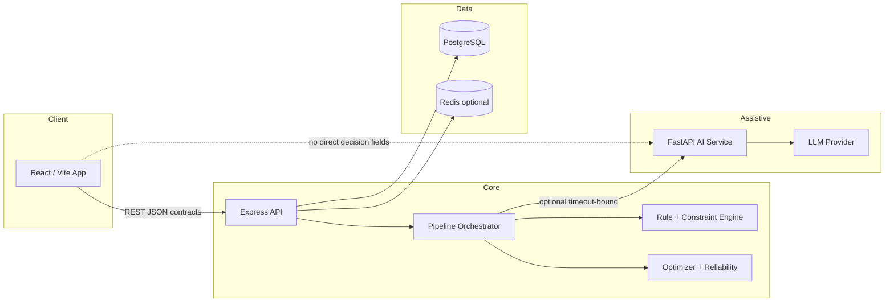

# AAROGYA

### Contract-first meal intelligence for Ayurveda-informed planning with a deterministic safety core.

> Deterministic meal planning and recommendation where hard constraints and versioned APIs decide the plate—not the LLM.


---

## Overview

People who want constitution-aware eating often get either generic calorie advice or opaque AI meal lists that ignore allergies, diet rules, and reproducibility. **AAROGYA** targets **constraint-heavy and constitution-curious planners** (B2C) and **integrators** (B2B-lite) who need auditable outputs.

The system runs a **fixed multi-stage pipeline** (template → candidates → constraints → scoring → diversity → optimizer → reliability) over catalog data, returns **versioned JSON contracts** (`DecisionRequest_v1`, `DecisionResponse_v1`, `Trace_v1`), and uses a **Python assistive service** only for explanation, RAG, prakriti, and parsing—never to override P0 safety or selection fields.

---

## Architecture

### High-Level Diagram



### Key Design Decisions

**Contract-first API and module boundaries**  
Every plan request/response is AJV-validated against immutable `_v1` schemas with `schema_version` and `compatibility`. **Tradeoff:** slower iteration on payloads; breaking changes require `_v2` and coordinated client updates.

**Deterministic core with assistive AI on the side**  
Selection, scoring tie-breaks, and relaxation ladder are fixed in Node; ML/RAG may enrich explanations and profiles but **cannot inject** `meal`, `selection`, or ranking fields (enforced in orchestrator + frontend build guard). **Tradeoff:** AI outages degrade narrative quality, not safety or plan existence.

**P0-never-relaxed reliability ladder**  
Recovery passes drop P3, then P2+P3, then P1+P2+P3; P0 rules stay active and outputs are re-checked after each pass. **Tradeoff:** sparse catalogs hit fallback or low-confidence plans instead of unsafe relaxations.

**Dual persistence model**  
Prisma handles users, context JSON, history, adherence; raw SQL catalogs supply foods, rules, templates, and plan artifacts at runtime. **Tradeoff:** two migration paths must stay aligned for full production health.

**Hybrid food / recipe unit (transitional)**  
Candidates can bridge `RecipeAggregate_v1`; scoring and optimizer still operate on food-shaped meal slots until recipe-first migration completes (flag: `AAROGYA_RECIPE_FIRST_PIPELINE`). **Tradeoff:** recipe semantics are not yet end-to-end in the optimizer.

---

## Tech Stack

| Layer | Technology | Why |
|-------|------------|-----|
| Frontend | React 18, Vite, Zustand, TypeScript | Planner, onboarding, ops-style dashboard/trace; client routes all decisions through backend APIs |
| Backend | Node.js, Express, AJV | Canonical deterministic engine + contract validation at the edge |
| Database | PostgreSQL, Prisma + SQL catalogs | Durable identity/context; versioned food/rule/template data for repeatable plans |
| Cache | Redis (optional) | Idempotency and cache layers when `USE_REDIS=true` |
| Assistive AI | Python FastAPI | Isolated LLM/RAG/prakriti/parse with timeouts; failures do not block core pipeline |
| Observability | Pino, Prometheus `/metrics` | Structured pipeline stage logs and KPI hooks for engineering surfaces |
| CI | GitHub Actions, `npm run verify` | Lint, build, extended tests, phase-1 suite, golden-path smoke |

---

## Features

### Planning Engine

- Single-meal, full-day, and **7-day weekly** orchestration (`/plan`, `/plan/daily`, `/plan/weekly`)
- Template-driven slots with beam optimizer and deterministic greedy fallback
- Post-plan **Trace_v1** with per-stage counts, P0 stats, and relaxation level

### Safety & Constraints

- Priority-tier rules: reject / penalize with **P0 output compliance** after reliability passes
- Allergy, diet type, and user-state filters before scoring
- Controlled vocabulary for symptoms and goals (no silent enum coercion)

### Adaptation & Feedback

- History-aware diversity penalties and preference weights (DB-backed when configured)
- Adherence and feedback paths feed deterministic re-scoring—not ad-hoc LLM edits

### Assistive & Audit Surfaces

- Knowledge / assistant queries routed via backend (frontend must not call AI for decision fields)
- Trace and observability pages for engineering transparency (health, metrics, telemetry)
- Optional AI explanations merged into `DecisionResponse_v1` without changing selection

---

## System Flow

**Weekly plan journey (primary product flow):**

1. User completes **onboarding** → goals, constraints, prakriti estimate, diet → persisted `UserContext` (JWT session when `JWT_SECRET` is set).
2. User opens **Planner**, selects **Weekly**, sets calorie cap and preferences → frontend builds `PlanWeeklyRequest_v1`.
3. **POST `/plan/weekly`** validates request → for each of 7 days, runs breakfast / lunch / dinner through the same deterministic pipeline with rolling exclusions for cross-day diversity.
4. Backend returns **`PlanWeeklyResponse_v1`**: `weekly_plan[]` (meals, per-day nutrition, score, confidence) plus aggregated **`trace_summary`** (P0 pass/fail, stage totals).
5. User views cards per day in the UI; optional **Trace** route inspects pipeline evidence; **Knowledge** Q&A uses RAG through backend only.

---

## Getting Started

### Prerequisites

- **Node.js 20+** (CI uses 20; local 18+ may work)
- **npm** (workspaces at repo root)
- **PostgreSQL** recommended for full catalog + auth (see `docker compose` below)
- **Python 3.10+** only if running `apps/ai-service` locally

### Installation

```bash
git clone <repo-url>
cd AYUDIET_FINAL
npm ci
```

### Environment Setup

```bash
cp apps/backend/.env.example apps/backend/.env
# Set at minimum: CORS_ORIGINS, JWT_SECRET (for auth routes)
# For full health: DATABASE_URL (see docker-compose credentials in .env.example)
```

Optional AI service:

```bash
cp apps/ai-service/.env.example apps/ai-service/.env   # if present
```

### Running Locally

```bash
# Postgres + Redis (optional)
docker compose up -d

# Backend + frontend (from repo root)
npm run dev
```

- API: `http://localhost:5000` (default)
- App: `http://localhost:5173` (default)

Detailed ops: [docs/RUNBOOK_LOCAL.md](docs/RUNBOOK_LOCAL.md)

### Running Tests

```bash
# CI parity (lint, build, backend suites, phase-1, golden path)
npm run verify

# Subsets
npm run test:all
npm run test:extended
npm run golden-path-smoke
```

---

## API Reference

Non-obvious or contract-heavy endpoints only. Full shapes: [docs/CONTRACTS.md](docs/CONTRACTS.md), [docs/PRD.md](docs/PRD.md).

| Method | Endpoint | Auth | Description |
|--------|----------|------|-------------|
| POST | `/plan` | Optional | Single meal; `DecisionRequest_v1` → `DecisionResponse_v1` + trace |
| POST | `/plan/daily` | Optional | Three meals (breakfast/lunch/dinner) in one response |
| POST | `/plan/weekly` | Optional | `PlanWeeklyRequest_v1` → 7-day plan + `trace_summary` |
| POST | `/plan/replay` | Optional | Re-run stored decision input for determinism/debug |
| POST | `/replace-food` | Context | Swap one item in an existing plan slot with re-validation |
| POST | `/regenerate-meal` | Context | Regenerate one meal slot under current constraints |
| POST | `/assistant/query` | Varies | Bounded assistive orchestration (not meal selection) |
| GET | `/health` | No | DB/LLM/degraded mode signaling for ops |
| GET | `/metrics/prometheus` | No | Prometheus scrape of pipeline KPIs |

Auth routes (`/auth/signup`, `/auth/login`) and `/user/*` require `JWT_SECRET`.

---

## Known Limitations

- **Degraded catalog without `DATABASE_URL`:** server can start with JSON fallbacks; plans repeat more often and health reports degraded DB.
- **Weekly diversity vs. small fallback catalog:** strict tests expect unique meals across 7 days; limited food samples can fail diversity assertions even when API returns 200.
- **Calorie target semantics:** per-meal pipeline runs can produce **high daily totals** when each slot is a full template meal (multi-item), not a single 700 kcal plate.
- **Recipe-first pipeline is partial:** `AAROGYA_RECIPE_FIRST_PIPELINE` bridges recipes into candidates; optimizer/scoring remain food-shaped until R-01/R-02 complete.
- **Single-region, single-process assumptions:** in-memory idempotency/window patterns are not distributed; scale-out needs shared Redis/DB coordination.
- **Wellness product, not clinical software:** no HIPAA/GDPR DPA or diagnostic claims in scope.

---

## What I Would Do Next

- Enforce **unique `(user_id, week, recipe_id)`** (or meal fingerprint) in weekly planner state to close cross-day repetition on small catalogs.
- Split **daily calorie budget** from **per-slot `max_calories`** in weekly orchestration so UI targets match aggregated `nutrition_summary`.
- Add **integration test** for full `PlanWeeklyRequest_v1` → `validatePlanWeeklyResponse` on a seeded Postgres fixture to lock contract + diversity behavior in CI.

---

## Documentation

| Doc | Purpose |
|-----|---------|
| [docs/PRD.md](docs/PRD.md) | Product requirements, personas, F-01–F-08, release criteria |
| [docs/ARCHITECTURE.md](docs/ARCHITECTURE.md) | System structure and module boundaries |
| [docs/CONTRACTS.md](docs/CONTRACTS.md) | Versioned schemas and governance |
| [docs/MASTER_EXECUTION_PLAN.md](docs/MASTER_EXECUTION_PLAN.md) | Phased engineering checklist |
| [docs/RUNBOOK_LOCAL.md](docs/RUNBOOK_LOCAL.md) | Local dev, migrations, CI parity |

---

## License

Proprietary — major academic / project repository unless a `LICENSE` file is added by the maintainers.
